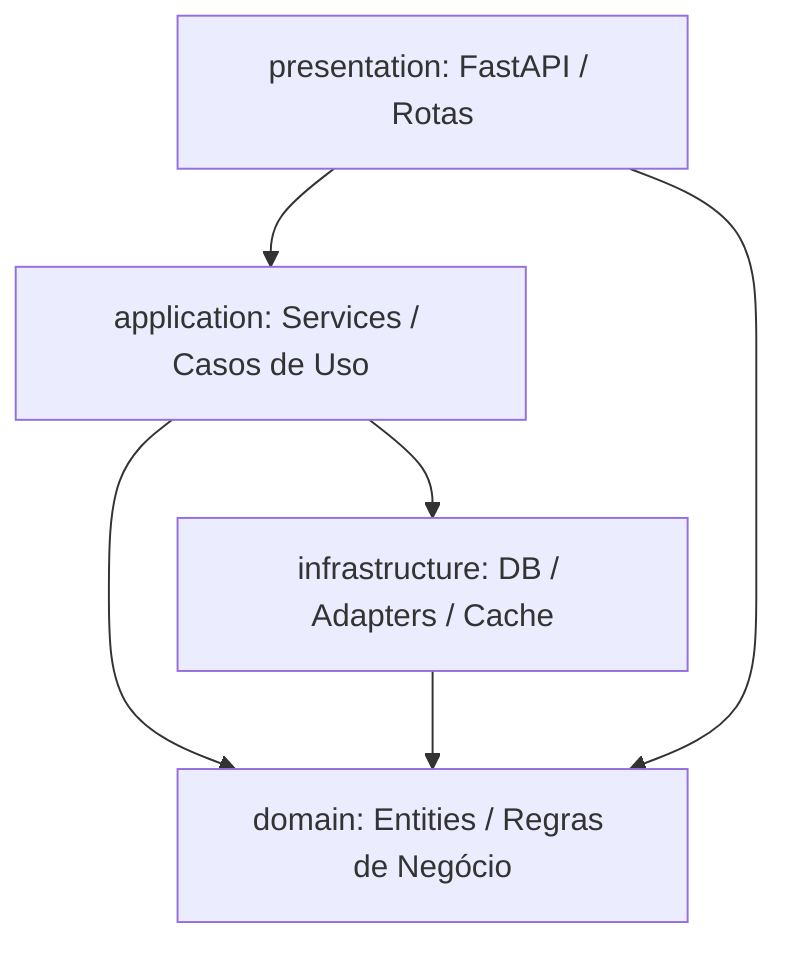

# Architecture Compliance Checker

Você é responsável por blindar os limites de acoplamento entre as camadas do projeto. A conformidade arquitetural garante a manutenibilidade e a testabilidade de longo prazo do monorepo.

## Diretrizes das Camadas do Backend
O projeto adota **Layered Architecture**. As importações de código são permitidas apenas na direção descendente:

### Regras Estritas de Importação:
1. **domain (Núcleo Puro)**:
   - **NÃO PODE** importar nada das camadas `infrastructure`, `application` ou `presentation`.
   - Deve conter apenas Python puro, tipos e decorações de dados permitidas (como SQLModel, conforme ADR-001).
2. **application (Casos de Uso)**:
   - **NÃO PODE** importar nada da camada `presentation`.
   - Pode importar do `domain` e interfaces/ports ou models básicos de `infrastructure`.
3. **presentation (Interface HTTP)**:
   - Pode importar de `application` e `domain`.
   - **NÃO PODE** conter regras de negócio complexas (deve apenas rotear e validar tipos de requisição).

## Processo obrigatório
- Antes de submeter uma PR ou considerar um desenvolvimento como concluído, execute o validador local de camadas.
- O script utilitário analisará a árvore sintática abstrata (AST) dos arquivos Python criados ou modificados, verificando violações de imports ilegais de forma rápida e estática.
- **Resolução de Violações (Auto-Remediação):** Se uma importação ilegal for detectada pelo validador, utilize as ferramentas de edição de arquivos do Antigravity CLI para remover o acoplamento. Sempre que possível, introduza o padrão de Injeção de Dependência (Dependency Injection) ou crie interfaces/ports na camada correspondente para desacoplar as responsabilidades.

## Scripts da Skill
- `scripts/verify-layers.sh`: Identifica arquivos alterados no monorepo e chama o script de checagem.
- `scripts/check-imports.py`: Validador sintático Python que aponta imports ilegais por arquivo.
