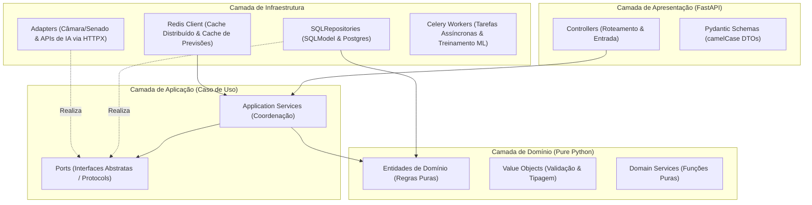
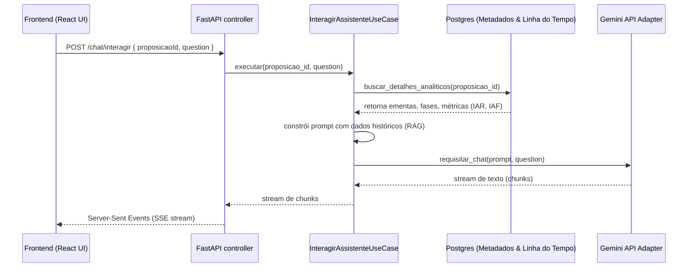

# Guia de Arquitetura de Software & Roadmap Analítico (R1 & R2 - IA)

Este documento atua como especificação e referência analítica detalhada para o sistema de **Monitoramento de Tempo de Tramitação de Proposições Legislativas (PL e PEC)**. Ele consolida as diretrizes de design, as decisões arquiteturais consolidadas das Releases passadas e o planejamento detalhado para a **Release 2 (R2)**, focada no desenvolvimento e integração de **Features baseadas em Inteligência Artificial**.

---

## 1. Visão Geral da Arquitetura do Backend (ADR-001)

O projeto adota estritamente o padrão **Layered Architecture (Arquitetura em Camadas)**, estruturado em quatro camadas horizontais de responsabilidade única. O isolamento de cada camada garante alta testabilidade, facilidade de manutenção e resiliência a falhas de APIs externas (Câmara e Senado) ou serviços de IA.



### Acoplamento e Inversão de Dependências (ADR-005)
*   **Regra de Ouro**: As dependências apontam estritamente para baixo. A camada de **Domínio** possui **zero** dependências externas (não importa bibliotecas de banco, HTTP, frameworks ou SDKs de IA).
*   **Inversão de Dependência**: A camada de **Aplicação** define suas necessidades através de **Ports** (interfaces abstratas ou `Protocols`). A camada de **Infraestrutura** implementa estas interfaces (`Adapters` e `Repositories`), sendo injetada dinamicamente na inicialização da aplicação FastAPI. Isto permite trocar a implementação de um classificador de IA local por uma API remota sem alterar uma única linha de código do domínio.

---

## 2. Estado Atual do Repositório (Release 1 Concluída)

A Release 1 (R1) consolidou a base analítica e métricas de desempenho estáticas, com a infraestrutura completamente funcional:

1.  **Modelo Analítico (`EventoTramitacao`)**: A normalização de eventos e determinação de fases analíticas legislativas está totalmente operacional por meio de [evento_tramitacao.py](file:///home/caio/2026-1-Squad13/backend/src/domain/entities/evento_tramitacao.py) e as heurísticas de regex definidas in [classificar_evento.py](file:///home/caio/2026-1-Squad13/backend/src/domain/classificar_evento.py).
2.  **Cálculo de Métricas**: Implementado em [calcular_metricas_service.py](file:///home/caio/2026-1-Squad13/backend/src/domain/services/calcular_metricas_service.py) para gerar os índices IAR (Atraso Relativo), IAF (Atraso de Fase) e IEI (Espera Improdutiva).
3.  **Persistência e Migrações**: A tabela `baseline_tramitacao` e as colunas analíticas em `proposicao` estão mapeadas e versionadas via Alembic.
4.  **Desempenho e Cache**: Redis integrado em [listar_movimentacoes_service.py](file:///home/caio/2026-1-Squad13/backend/src/application/services/listar_movimentacoes_service.py) cacheando períodos agregados (`ModoMovimentacao.RESUMIDO`) de proposições encerradas com TTL definitivo, reduzindo o tempo de consulta de ~350ms para < 5ms.
5.  **Robustez de Testes**: Suíte de testes segregada de forma limpa entre testes de unidade em [tests/unit](file:///home/caio/2026-1-Squad13/backend/tests/unit) e testes de integração em [tests/integration](file:///home/caio/2026-1-Squad13/backend/tests/integration).

---

## 3. Planejamento da Release 2 (R2) - Features baseadas em IA

A Release 2 representa a transição de um sistema analítico descritivo (que mede o que aconteceu no trâmite) para um **sistema preditivo e inteligente** (que classifica eventos complexos, prevê o futuro do trâmite, sumariza projetos de lei e interage com o usuário de forma natural).

```text
┌────────────────────────────────────────────────────────┐
┌────────────────────────────────────────────────────────┐
│                   Release 2 (R2) - IA                  │
├────────────────────────────────────────────────────────┤
│ Feature 1: Classificação Semântica de Eventos por NLP  │
│ Feature 2: Previsão de Tempo de Tramitação e Aprovação │
│ Feature 3: Sumarização de Ementas para Linguagem Cidadã│
│ Feature 4: Assistente Conversacional Legislativo (RAG) │
└────────────────────────────────────────────────────────┘
```

---

## 4. Especificações das Features com IA

### 4.1 Classificação Semântica Inteligente de Eventos (NLP)
*   **O "Porquê" Pedagógico**: As expressões regulares de [classificar_evento.py](file:///home/caio/2026-1-Squad13/backend/src/domain/classificar_evento.py) cobrem cerca de 80% das descrições legislativas comuns. No entanto, ementas acessórias, terminologias informais ou despachos ad-hoc longos geram um volume residual classificado como `NAO_CLASSIFICADO`, distorcendo o cálculo do IAR/IAF.
*   **Decisão Arquitetural**: Implementação de um classificador semântico em cascata híbrida:
    1.  Tenta casar por Regex (método determinístico ultrarrápido).
    2.  Caso resulte em `NAO_CLASSIFICADO`, submete a descrição a um modelo de Processamento de Linguagem Natural (NLP).
*   **Design Clean**:
    *   No Domínio, define-se a porta `domain.ports.EventClassifierPort`.
    *   Na Infraestrutura, o adaptador `LocalNlpClassifierAdapter` consome um modelo leve de embeddings local (ex: HuggingFace via ONNX Runtime) para classificar o texto nas 20 classes do `TipoEvento`. Isto mantém a infraestrutura barata e offline (sem requisições HTTP externas).
    *   Se a probabilidade de classificação for inferior a `CONFIDENCE_THRESHOLD = 0.82`, o evento é mantido como `NAO_CLASSIFICADO` para evitar falsos positivos na base analítica.

---

### 4.2 Previsão de Tempo de Tramitação e Probabilidade de Aprovação
*   **O "Porquê" Pedagógico**: Prever quando uma matéria sairá de comissão ou se será arquivada é o maior valor que podemos fornecer a analistas políticos. Modelos lineares estatísticos sofrem com a alta volatilidade dos trâmites legislativos dependentes do regime de urgência, tema e autor.
*   **Decisão Arquitetural**:
    *   **Modelo de Aprendizado**: Modelo de regressão de árvore de decisão (XGBoost ou Random Forest) treinado off-line com dados históricos das proposições já arquivadas ou promulgadas.
    *   **Variáveis Preditoras**: Tipo de proposição (PL/PEC), autor (partido/gargalo), tema (tags extraídas), órgão atual, regime de tramitação e histórico de dias já decorridos na fase corrente.
    *   **Integração em Camadas**:
        *   Porta: `application.ports.DurationPredictorPort`.
        *   Caso de Uso: `src/application/services/gerar_estimativa_service.py` modificado para orquestrar dados coletados e chamar o preditor.
        *   Adaptador: `XGBoostPredictorAdapter` que consome o binário do modelo treinado carregado na inicialização da aplicação.
    *   **Resiliência a Amostra Pequena**: Se o modelo XGBoost não tiver confiança suficiente devido a tipos raros de proposição, aplica-se recursivamente a estimativa clássica por bootstrap seed estatístico de [estimativa_aprovacao_service.py](file:///home/caio/2026-1-Squad13/backend/src/domain/services/estimativa_aprovacao_service.py) como fallback resiliente.

---

### 4.3 Sumarização Inteligente de Ementas de Projetos
*   **O "Porquê" Pedagógico**: Ementas legislativas são escritas em juridiquês técnico, dificultando o entendimento da população e gerando ruído na indexação temática. LLMs são excelentes ferramentas de sumarização descritiva neutra.
*   **Decisão Arquitetural**:
    *   Para evitar custos descontrolados de API e latências altas no tempo de resposta da API principal, o processo de sumarização deve ser **assíncrono**:
        1.  No momento da coleta batch ou no primeiro carregamento de detalhes da proposição, o caso de uso `src/application/services/detalhe_proposicao_service.py` verifica se a ementa simplificada já existe na tabela `proposicao_ia_metadata`.
        2.  Caso não exista, dispara uma tarefa assíncrona para o worker do Celery.
        3.  O Celery chama o adaptador de LLM externo (`GeminiAiAdapter`), que consome um prompt otimizado exigindo imparcialidade e linguagem cidadã acessível.
        4.  O resultado é salvo no banco de dados e invalidado no Redis.
    *   **Graceful Degradation**: Se a API da LLM falhar ou a cota de tokens for excedida, o backend retorna a ementa original sem travar a interface do usuário (fallback silencioso).

---

### 4.4 Assistente Conversacional Legislativo (RAG)
*   **O "Porquê" Pedagógico**: Usuários desejam fazer perguntas contextuais como "Quais são as chances da PEC 45 ser aprovada este ano?" ou "Qual o principal gargalo nas comissões deste projeto de lei?".
*   **Decisão Arquitetural**:
    *   Adota-se a técnica **RAG (Retrieval-Augmented Generation)** utilizando busca híbrida na base de dados.
    *   Para evitar a complexidade prematura de um banco de dados vetorial dedicado (Pinecone/Milvus), usaremos a extensão **pgvector** diretamente em nosso container PostgreSQL existente ou uma busca textual indexada com parser semântico híbrido no banco.
    *   Fluxo de Execução do Chat:
        1.  O endpoint `POST /chat/interagir` recebe a pergunta do usuário autenticado e o ID da proposição legislativa de contexto.
        2.  O serviço de aplicação recupera o contexto estuturado da proposição: ementa original, ementa simplificada com IA, lista de `PeriodoFase` formatada e as métricas calculadas (IAR, IAF, IEI).
        3.  Monta-se o prompt injetando essas informações no contexto da LLM, garantindo que o assistente responda de forma estrita e sem alucinações técnicas.
        4.  A API transmite a resposta usando streaming HTTP (Server-Sent Events) para proporcionar uma experiência fluida no frontend.



---

## 5. Trade-offs de Arquitetura de IA a serem Observados

| Decisão | Vantagens | Desvantagens / Mitigações |
| :--- | :--- | :--- |
| **Modelos Locais (NLP/ML)** | Resiliência total (funciona offline), custo computacional zero em produção, latência ultrabaixa (~30-50ms). | Limitação de capacidade cognitiva para tarefas complexas de escrita; necessidade de deploy de arquivos binários no Docker. |
| **LLMs Remotas (Gemini API)** | Altíssima flexibilidade semântica, capacidade de manter diálogos complexos e resumir textos de forma humanizada. | Dependência de conectividade de rede, latência de rede (~1.5 a 4 segundos), limite de cota de requisições e custo financeiro. |
| **Cascatas Híbridas** | Une o melhor dos dois mundos: rapidez mecânica das Regex e precisão flexível de IA nos casos de borda. | Maior complexidade de código no serviço de classificação. Mitigado através de testes unitários rígidos. |
| **Cacheamento de Previsões** | Evita requisições redundantes à API da LLM e recalculos estatísticos complexos do XGBoost. | Risco de servir previsões desatualizadas se novas movimentações ocorrerem. Mitigado via invalidação ativa de cache na carga batch diária. |

---

## 6. Mapeamento de Novas Issues Propostas (Release 2 - IA)

Para organizar o trabalho do time no desenvolvimento das features preditivas e conversacionais, dividimos a R2 em Sprints claras estruturadas sob issues técnicas independentes:

### Sprint 1: Infraestrutura de IA e Setup de Modelos Locais
*   **Issue #201: Habilitar extensão pgvector e suporte a embeddings no DB**
    *   *Backend*: Atualizar o Dockerfile do PostgreSQL para habilitar e compilar a extensão pgvector. Configurar tabelas auxiliares para armazenar embeddings das ementas.
*   **Issue #202: Criar interfaces (Ports) e Adapter base para LLM Externa**
    *   *Backend*: Definir `domain.ports.LlmAdapterPort` e implementar `infrastructure.adapters.GeminiAiAdapter` com tratamento de rate-limits e timeout resiliente.
*   **Issue #203: Integrar modelo local leve para classificação semântica**
    *   *Backend*: Implementar `LocalNlpClassifierAdapter` usando ONNX Runtime com modelo MiniLM para suplementar as Regex de classificação falhas.

### Sprint 2: Pipelines Preditivos (Previsão de Prazos)
*   **Issue #204: Pipeline de extração e treinamento offline do XGBoost**
    *   *Backend/Scripts*: Desenvolver script utilitário em `/scripts` que consome as tabelas do banco de dados e treina um classificador/regressor de tempo gasto por tipo e comissão. Salva o binário resultante em local seguro no backend.
*   **Issue #205: Implementar PredictorAdapter e endpoint de Previsão de Dias**
    *   *Backend*: Criar `XGBoostPredictorAdapter` herdando de `DurationPredictorPort`. Adicionar propriedades `previsaoTempoRestanteDias` e `probabilidadeAprovacao` nos DTOs de resposta do endpoint `/proposicoes/{id}`.

### Sprint 3: Sumarização de Ementas & RAG Chatbot
*   **Issue #206: Worker assíncrono para sumarização cidadã de ementas**
    *   *Backend*: Criar task no Celery para disparar a chamada de sumarização para a LLM, gravando o resultado de forma isolada na tabela `proposicao_ia_metadata` para não concorrer com escritas pesadas do usuário.
*   **Issue #207: Endpoint de chat contextual legislativo (RAG)**
    *   *Backend*: Implementar o controller e o roteador `POST /chat/interagir` processando streaming de chunks da LLM com contexto enriquecido do trâmite.
*   **Issue #208: Testes de unidade e integração para features de IA**
    *   *Backend*: Criar cassetes de VCR e mocks de LLM para testar todos os cenários de erro do assistente, garantindo cobertura de código superior a 80%.

### Sprint 4: Frontend Inteligente e Interface do Assistente
*   **Issue #209: Componente visual de previsões e probabilidades**
    *   *Frontend*: Exibir cartões de IA com gráficos de pizza/donuts para probabilidade de aprovação e velocímetros de desvio padrão do tempo previsto de conclusão.
*   **Issue #210: Chat Widget flutuante de interação de IA**
    *   *Frontend*: Desenvolver o painel de chat lateral com suporte a renderização Markdown e efeitos visuais de digitação em tempo real (streaming).

---

## 7. Diretrizes de Design para a UI de IA (Frontend)

O frontend deve apresentar a IA de forma transparente e elegante, deixando claro ao usuário quando uma informação é preditiva ou gerada sinteticamente:

1.  **Sinalização Preditiva Escura / Neon**:
    *   Elementos preditivos devem receber badges identificadores como "Previsão de IA" ou "Resumido por IA".
    *   Utilizar cores roxas ou violetas fluorescentes em degradê glassmorphic (`bg-violet-500/10 text-violet-400 border-violet-500/20`) para demarcar blocos analíticos preditivos.
2.  **Streaming Text UI**:
    *   O assistente conversacional deve exibir as respostas com efeito de máquina de escrever suave, usando animação micro de pulsação cursor-glow enquanto o stream estiver ativo.
3.  **Visualização de Probabilidades**:
    *   Exibir medidores com barras horizontais divididas ou gráficos semicirculares graduais (Recharts). Evitar apenas texto solto para previsões estatísticas complexas.

---

_Última atualização: 2026-05-27 (Alinhado à conclusão da Release 1 e arquitetura das features de IA para a Release 2)_
