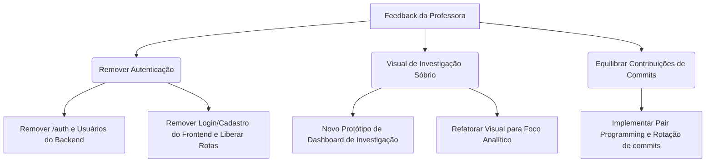

# Relatório de Encerramento — Release 1 (R1)
**Data de Fechamento:** 27 de Maio de 2026  
**Contexto:** Encerramento do MVP e Apresentação para a Banca Acadêmica  

---

## 1. Objetivo da Release 1 (R1)
A meta principal estabelecida para a R1 foi construir um **fluxo básico de ponta a ponta operacional com dados reais**, permitindo a validação da arquitetura e das integrações essenciais.

O fluxo alvo definido e demonstrado na apresentação foi:
$$\text{Cadastro de Usuário} \longrightarrow \text{Autenticação} \longrightarrow \text{Busca de Proposição} \longrightarrow \text{Visualização Detalhada} \longrightarrow \text{Histórico de Tramitação}$$

---

## 2. Entregáveis Implementados e Tecnologias
O estado final do repositório no marco da R1 apresenta um ecossistema de software estruturado e aderente às melhores práticas de engenharia de software.

### A. Backend Robusto e Arquitetura em Camadas
*   **Layered Architecture (Arquitetura em Camadas):** Separação clara de responsabilidades em 4 camadas horizontais (`presentation` $\rightarrow$ `application` $\rightarrow$ `domain` $\rightarrow$ `infrastructure`), de acordo com o padrão registrado em [ADR-001](file:///home/caio_martins/2026-1-Squad13/docs/adr/ADR-001-layered-architecture.md). Isso garante o isolamento das regras de negócio contra modificações externas.
*   **Isolamento de APIs Externas (Adapter Pattern):** Implementação dos adaptadores `CamaraAdapter` e `SenadoAdapter` em [ADR-005](file:///home/caio_martins/2026-1-Squad13/docs/adr/ADR-005-adapter-pattern.md). Toda a comunicação HTTP com os endpoints legislativos é encapsulada, garantindo resiliência técnica caso as APIs públicas modifiquem seu esquema.
*   **Modelo de Dados Legislativos Real:** Substituição completa de mocks estáticos por consultas dinâmicas ao banco **PostgreSQL** (configurado via Docker em [ADR-002](file:///home/caio_martins/2026-1-Squad13/docs/adr/ADR-002-postgresql.md)) usando `SQLModel` e `Pydantic`.
*   **Seed de Dados Idempotente:** Script automatizado (`backend/src/init_db.py`) que consome os adaptadores oficiais e popula o banco com dados reais das duas casas legislativas (Câmara e Senado) no primeiro deploy.
*   **Busca Otimizada e Paginação:** Endpoint `GET /proposicoes` otimizado utilizando paginação SQL real via `LIMIT`/`OFFSET` e suporte a filtros cumulativos (tipo, ano, autor, UF do autor) com buscas case-insensitive (`ILIKE`), otimizando o consumo de memória do servidor.
*   **Mecanismo de Autenticação JWT:** Endpoints de `/auth/register` e `/auth/login` em [auth_controller.py](file:///home/caio_martins/2026-1-Squad13/backend/src/presentation/controllers/auth_controller.py), gerenciando criação de usuários com senhas hash (usando Bcrypt) e verificação de sessões via tokens JWT em rotas privadas.

### B. Frontend Responsivo e Integrado
*   **Integração Real:** Conectado à API do FastAPI, convertendo as respostas `snake_case` do backend para a convenção `camelCase` do TypeScript automaticamente nas chamadas de rede.
*   **Dashboard e Dossiê:** Telas com filtros funcionais, busca, listagem paginada e detalhamento dinâmico contendo dados de autoria, ementas, links para portais oficiais e cálculo do tempo total de tramitação com indicação visual para proposições paradas há mais de 180 dias.

### C. Qualidade e CI/CD
*   **Continuous Integration (CI):** Workflows automatizados de GitHub Actions executados a cada Pull Request para `develop` ou `main`, realizando linting estrito no backend (Ruff) e no frontend (ESLint/Prettier), checagem de tipos estática (TypeScript compiler `tsc`) e execução das baterias de testes.
*   **Estratégia de Testes:** Bateria de testes automatizados com `pytest` (backend) e `vitest` (frontend), separando testes unitários rápidos de lógica de domínio e testes de integração com banco PostgreSQL real e chamadas mockadas para as APIs governamentais (conforme planejado em [ADR-007](file:///home/caio_martins/2026-1-Squad13/docs/adr/ADR-007-testing-strategy.md)).
*   **Squad Dashboard:** Aplicação standalone para governança contínua, exibindo burndown dinâmico, velocidade de entregas por sprint e métricas de cobertura de código reais geradas pelos pipelines de integração contínua.

---

## 3. Feedback da Professora (Banca da R1)

Na apresentação oficial de encerramento da Release 1 para a professora, o grupo recebeu elogios pelo nível de maturidade técnica das implementações (especialmente no backend, pipeline de CI e automações do dashboard). No entanto, foram levantadas recomendações cruciais de mudança de escopo e governança de projeto.

### Recomendações e Críticas:
1.  **Simplificação de Acesso (Remoção da Autenticação):**
    *   *Feedback:* O sistema deve funcionar sob a premissa de livre acesso público. Um portal de acompanhamento e monitoramento legislativo perde fluidez e acessibilidade ao forçar o cadastro de usuários e login para acesso aos dados analíticos do dashboard.
    *   *Diretriz:* Remover o sistema de cadastro e autenticação de usuários, fornecendo acesso direto a todos os recursos de consulta e ao dashboard.
2.  **Design Sóbrio e Confiável para Investigadores:**
    *   *Feedback:* A interface do frontend necessita de um tom mais sóbrio e pragmático. O design atual deve ser refatorado para assemelhar-se a um **dashboard analítico robusto e confiável**, voltado para pesquisadores, jornalistas e investigadores institucionais (eliminando elementos visuais excessivamente corporativos ou decorativos em favor de densidade de dados e clareza técnica).
3.  **Disparidade de Commits no Repositório:**
    *   *Feedback:* A professora analisou o gráfico de contribuições e identificou uma discrepância expressiva no volume de commits entre os integrantes da equipe. Manter um projeto de Engenharia de Software com essa disparidade é inviável, sinalizando gargalos no fluxo de desenvolvimento ou centralização técnica.
    *   *Diretriz:* Adotar práticas ágeis que promovam o equilíbrio do desenvolvimento e a distribuição equitativa das contribuições de código (como programação em par, rotação de responsabilidades de escrita nos commits e revisões colaborativas).

---

## 4. Plano de Ação e Impacto no Escopo da R2

O feedback da professora foi absorvido e gerou alterações imediatas no planejamento da Release 2. Abaixo detalhamos os trade-offs e o racional das mudanças:

### Trade-offs & Decisões Pedagógicas:
*   **Simplificação Técnica vs. Desperdício de Código:** Embora o sistema de autenticação JWT represente um esforço técnico relevante que agora será desativado, o grupo concorda com o trade-off: a eliminação das barreiras de login reduz o atrito para o usuário e melhora a experiência de uso do portal. O código construído permanecerá arquivado no histórico de branches para fins de estudo acadêmico, mas será totalmente removido da branch principal de produção na R2.
*   **Foco na Densidade Visual (UI Sóbria):** Um visual para "investigadores" exige gráficos mais ricos, visualizações de séries temporais de tramitação detalhadas e tabelas densas, em vez de layouts vazios com muito espaçamento. O novo design priorizará paletas escuras discretas (sóbrias), fontes claras e limpas, e fácil comparação de baselines.
*   **XP (Extreme Programming) na Governança:** Para mitigar a disparidade de commits, o time passará a registrar commits no formato de pareamento (co-authoring no Git) e estruturará tarefas menores para que todos os membros submetam contribuições diretamente à branch `develop`.

Essas decisões estão integradas ao backlog atualizado do projeto e nortearão o desenvolvimento da Sprint 9 em diante.
