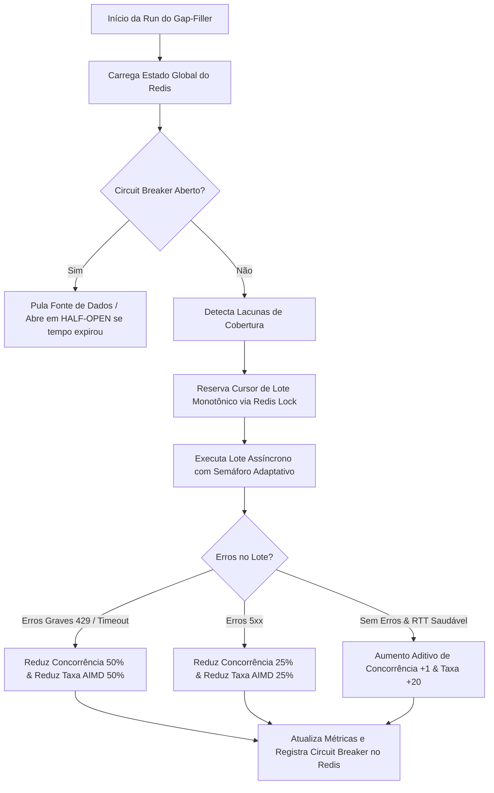

# Análise Operacional: Celery Worker & Métricas Dinâmicas

Esta análise visa avaliar o funcionamento do Celery worker no LexTrack, o comportamento das métricas dinâmicas e o algoritmo adaptativo de coleta de proposições (Gap-Filler), além de propor correções para inconsistências identificadas nos logs.

---

## 1. Status das Tarefas Celery (Beat & Worker)

O Celery Beat está escalonando e enviando as tarefas periódicas com precisão. Com base nos logs analisados, o status das tarefas diárias e periódicas está estruturado da seguinte forma:

| Nome da Task | Frequência | Horário de Execução (Brasília) | Último Status | Tempo de Execução | Detalhes / Resumo |
| :--- | :--- | :--- | :--- | :--- | :--- |
| `coletar_proposicoes_diario` | Diária | 02:37 | **Falha transitória** | N/A | Lançou `PendingRollbackError` decorrente de violação de chave estrangeira (`ForeignKeyViolation`) ao tentar persistir eventos de tramitação de IDs sem prefixo. |
| `recalcular_baselines_diario` | Diária | 03:00 | **Sucesso** | 7.5s | Criou 2 baselines IAR (atraso relativo) e 16 IAF (atraso por fase). |
| `processar_metricas_todas_ativas` | Diária | 04:00 | **Sucesso** | 103.8s | Processou 15.687 proposições com 100% de sucesso e 0 falhas. |
| `preencher_lacunas_cobertura` | A cada 15 min | `*/15` | **Sucesso** | ~15.2s | Coleta adaptativa (Gap-Filler) executada em modo `catch_up`, processando lotes de forma saudável. |

---

## 2. Como Funcionam as Métricas Dinâmicas e Táticas Adaptativas

O sistema de preenchimento de lacunas (`PreencherLacunasService`) implementa um algoritmo de **controle de fluxo adaptativo e resiliência a falhas** extremamente avançado baseado em 4 táticas principais:



### Detalhamento das Táticas:
1. **Tática 1: Pruning (Poda)**: Identifica e pula anos de tramitação históricos que já atingiram cobertura de dados superior a 99.5%, consolidando-os definitivamente para poupar banda e requisições.
2. **Tática 2: Concorrência Dinâmica (Semáforo Adaptativo)**: Ajusta o número de conexões assíncronas concorrentes de acordo com a latência (RTT P95) e falhas:
   - **RTT P95 < 400ms & Sem timeouts**: Aumenta concorrência em $+1$ (aditivo).
   - **Timeouts ou Erros Graves**: Reduz a concorrência em $50\%$ (multiplicativo).
   - **Erros 5xx**: Reduz a concorrência em $25\%$.
3. **Tática 3: Circuit Breaker Conservador**: Registra falhas na comunicação com as APIs externas no Redis.
   - Entra em estado `OPEN` bloqueando requisições por 15 minutos se houver 5 falhas consecutivas de rede, ou 30 minutos se a API externa responder com erro 429 (Rate Limit) em mais de 20% das requisições do lote.
   - Retorna em `HALF-OPEN` após expirar o tempo para testar um lote menor. Se rodar sem falhas, fecha novamente (`CLOSED`).
4. **Tática 4: Throughput Adaptativo (AIMD - Additive Increase Multiplicative Decrease)**: Calibra o tamanho dos lotes de requisições de acordo com o feedback das requisições anteriores:
   - **Sucesso sem erros**: Aumenta o tamanho do lote em $+20$ itens.
   - **Erros 429**: Reduz o lote em $50\%$ para despressurizar o rate-limiter da API do governo.
   - **Timeouts/5xx**: Reduz o lote em $25\%$.

---

## 3. Diagnóstico de Problemas e Bugs Encontrados

Após inspecionar os logs do Celery Worker, identificamos **três problemas estruturais** que estão impactando a execução ideal das tarefas:

### Bug A: ValueError Silenciado na Unificação (Crossover) de Proposições
* **Arquivo**: [listar_movimentacoes_service.py](file:///home/caio/2026-1-Squad13/backend/src/application/services/listar_movimentacoes_service.py#L140)
* **Descrição**: A classe `ListarMovimentacoesService` tenta unificar a linha do tempo de proposições que tramitam tanto na Câmara quanto no Senado. Contudo, ela executa a conversão direta para inteiro do ID do banco de dados, que já possui prefixo:
  ```python
  if "Câmara" in (proposicao.orgao_origem or ""):
      id_camara = int(proposicao.id)  # Lança ValueError para "camara:104333"
  else:
      id_senado = int(proposicao.id)  # Lança ValueError para "senado:80297"
  ```
* **Impacto**: O `asyncio.gather` silenciosamente consome os `ValueError` por causa de `return_exceptions=True` no `coletar_em_lote_service.py`. A tarefa de unificação falha silenciosamente para todos os lotes, deixando a coleta de eventos incompleta.

### Bug B: PendingRollbackError na Coleta Diária
* **Arquivo**: [coletar_em_lote_service.py](file:///home/caio/2026-1-Squad13/backend/src/application/services/coletar_em_lote_service.py#L143)
* **Descrição**: Quando um ID sem prefixo é fornecido (por exemplo, em chamadas diretas de endpoints da API ou fallbacks de compatibilidade onde `proposicao` é `None`), o resolvedor tenta inserir eventos diretamente na tabela `evento_tramitacao` vinculados a um ID puro (como `"104333"`), em vez do ID prefixado `"camara:104333"`.
* **Impacto**: Isso gera uma `ForeignKeyViolation` no Postgres, invalidando a transação da sessão do SQLAlchemy. Qualquer tentativa subsequente de interagir com o banco de dados na mesma transação gera um `PendingRollbackError`, abortando o registro de logs de auditoria e falhas da coleta diária.

### Bug C: ValueError no Parsing do Adaptador do Senado
* **Arquivo**: [senado_adapter.py](file:///home/caio/2026-1-Squad13/backend/src/infrastructure/adapters/senado_adapter.py#L270)
* **Descrição**: Ao parsear as emendas do Senado, o adaptador tenta aplicar `int()` diretamente a códigos literais que possuem letras sufixadas (por exemplo, `0113A`, `0087A`, `0096A`), os quais representam numerações de emendas substitutivas do Senado.
* **Impacto**: Lança `ValueError: invalid literal for int() with base 10`. O bloco try-except geral captura e descarta a proposição retornando `None`, o que causa perda de dados de proposições do Senado com esse tipo de emenda.

---

## 4. Plano de Ação para Correção (Incrementos Seguros)

Para solucionar esses problemas de forma definitiva, propomos as seguintes modificações estruturais e seguras no backend, respeitando a arquitetura em camadas e o isolamento de domínio:

### Etapa 1: Tornar a Extração de IDs Numéricos Robusta e Tolerante a Prefixos
No arquivo [listar_movimentacoes_service.py](file:///home/caio/2026-1-Squad13/backend/src/application/services/listar_movimentacoes_service.py), modificaremos a lógica de unificação e fallbacks para extrair a parte numérica do ID de forma segura antes de realizar a conversão para `int` e fazer chamadas na API.

### Etapa 2: Tratar com Segurança Letras Sufixadas em Emendas do Senado
No arquivo [senado_adapter.py](file:///home/caio/2026-1-Squad13/backend/src/infrastructure/adapters/senado_adapter.py), modificaremos o parsing de tags e números de emenda para extrair valores inteiros apenas se forem puramente numéricos, ou preservar o literal com fallback seguro, evitando exceções que abortam o processamento da proposição.

### Etapa 3: Expor Erros Ocorridos no Async Gather da Coleta
No arquivo [coletar_em_lote_service.py](file:///home/caio/2026-1-Squad13/backend/src/application/services/coletar_em_lote_service.py), adicionaremos logging detalhado no gather de eventos de movimentação. Isso nos garantirá visibilidade sobre falhas individuais em proposições sem silenciá-las.
