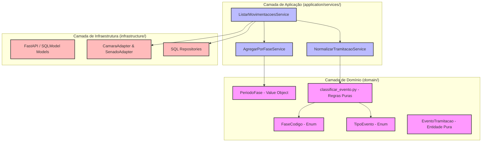
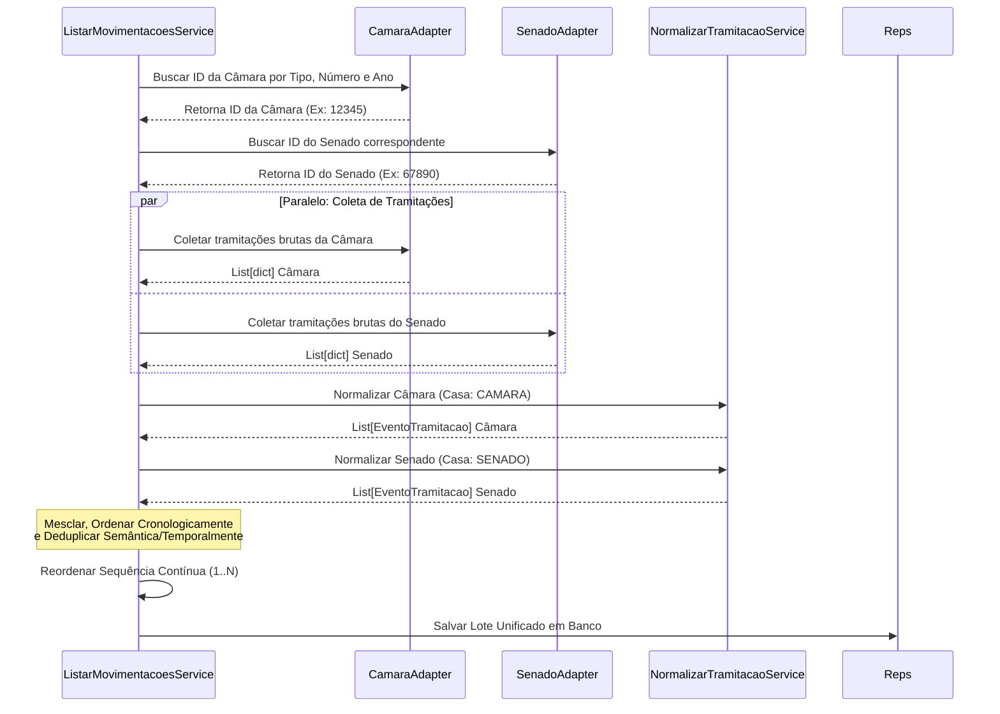

# Análise Holística e Pedagógica da Normalização de Fases, Eventos e Tramitações

Este documento apresenta uma análise profunda, técnica e conceitual de como a nossa plataforma resolve o desafio da **heterogeneidade do processo legislativo brasileiro**, transformando logs brutos e desconexos de duas APIs externas gigantes (Câmara dos Deputados e Senado Federal) in uma linha do tempo analítica, unificada, legível e determinística.

---

## 1. O Desafio e o "Porquê" da Normalização

As APIs públicas do Congresso Nacional possuem estruturas e semânticas radicalmente diferentes:
* **Granularidade:** A Câmara registra dezenas de movimentações acessórias (ex: "Apresentação de requerimento", "Enviado à comissão X", "Leitura de parecer"). O Senado possui um vocabulário próprio e, por vezes, menos fragmentado.
* **Fases Físicas vs. Fases Analíticas:** Um projeto de lei não tramita em uma ordem linear simples. Ele entra e sai de comissões, aguarda pauta, é retirado, volta para reavaliação, transita entre as duas casas legislativas e pode ser apensado ou arquivado a qualquer momento.
* **Vocabulário:** Dizer que um projeto foi "Aprovado" pode significar que foi aprovado na Comissão de Constituição e Justiça (o que não encerra o trâmite) ou aprovado no Plenário (o que o envia para a outra Casa ou para sanção).

Para responder a perguntas analíticas de alto nível — como *"Quanto tempo esta matéria passou em análise de comissões?"* ou *"A matéria está com trâmite atrasado?"* —, criamos uma **camada de normalização analítica robusta**. Ela traduz termos textuais livres em representações canônicas no domínio e projeta uma máquina de estados sobre o ciclo de vida da matéria.

---

## 2. A Arquitetura em Camadas (Layered Architecture)

Seguindo rigorosamente o perfil do `GEMINI.md`, a arquitetura do projeto isola completamente as regras de negócio de detalhes de banco de dados ou requisições HTTP:



* **Domínio Isolado (`src/domain/`):** Contém os enums [FaseCodigo](file:///home/caio_martins/2026-1-Squad13/backend/src/domain/entities/fase_codigo.py) e [TipoEvento](file:///home/caio_martins/2026-1-Squad13/backend/src/domain/entities/tipo_evento.py), a entidade [EventoTramitacao](file:///home/caio_martins/2026-1-Squad13/backend/src/domain/entities/evento_tramitacao.py) e as regras de classificação no módulo [classificar_evento.py](file:///home/caio_martins/2026-1-Squad13/backend/src/domain/classificar_evento.py). Não importa de onde vieram os dados, as regras são determinísticas e testadas isoladamente.
* **Aplicação (`src/application/`):** Contém os serviços de orquestração [NormalizarTramitacaoService](file:///home/caio_martins/2026-1-Squad13/backend/src/application/services/normalizar_tramitacao_service.py), [AgregarPorFaseService](file:///home/caio_martins/2026-1-Squad13/backend/src/application/services/agregar_por_fase_service.py) e [ListarMovimentacoesService](file:///home/caio_martins/2026-1-Squad13/backend/src/application/services/listar_movimentacoes_service.py).
* **Infraestrutura (`src/infrastructure/`):** Contém adaptadores de rede de APIs externas e repositórios baseados em banco de dados.

---

## 3. Especificação da Modelagem Físico-Lógica no Backend

Uma das decisões de design mais elegantes no backend do nosso projeto é o **desacoplamento completo entre a Entidade de Domínio Pura e o Modelo Físico de Banco de Dados**, mesmo ambos utilizando a biblioteca `SQLModel`.

### A) A Entidade de Domínio Pura ([evento_tramitacao.py](file:///home/caio_martins/2026-1-Squad13/backend/src/domain/entities/evento_tramitacao.py))
Representa a verdade do negócio. Não contém tags SQL, chaves estrangeiras físicas de banco ou definições de tabela. Ela serve como contrato puro de representação lógica e lida com as validações de dados por meio do Pydantic:

```python
class EventoTramitacao(SQLModel):
    evento_id: Optional[int] = None
    proposicao_id: str
    data_evento: str
    sequencia: int
    sigla_orgao: Optional[str] = None
    descricao_original: str
    tipo_evento: str
    fase_analitica_id: Optional[int] = None
    deliberativo: bool = False
    mudou_fase: bool = False
    mudou_orgao: bool = False
    remessa_ou_retorno: Optional[str] = None
    dias_na_etapa: int = 0
    tem_atraso: bool = False
    marca_apensacao: bool = False
    relevante: bool = False
    payload_bruto: Optional[dict] = None
```

### B) O Modelo Físico de Banco de Dados ([evento_tramitacao_model.py](file:///home/caio_martins/2026-1-Squad13/backend/src/infrastructure/database/models/evento_tramitacao_model.py))
Mapeia a entidade no banco de dados relacional. Contém as restrições físicas de integridade referencial (`foreign_key`), os metadados do ORM (`table=True`, `Column(JSON)`) e os **índices físicos de alto desempenho**:

```python
class EventoTramitacaoModel(SQLModel, table=True):
    __tablename__ = "evento_tramitacao"
    
    # Índice composto para otimizar a ordenação e a deduplicação
    __table_args__ = (
        Index(
            "ix_evento_tramitacao_prop_data_seq",
            "proposicao_id",
            "data_evento",
            "sequencia",
        ),
    )

    evento_id: Optional[int] = Field(default=None, primary_key=True)
    proposicao_id: str = Field(foreign_key="proposicao.id", index=True)
    data_evento: str
    sequencia: int
    sigla_orgao: Optional[str] = Field(default=None, index=True)
    descricao_original: str
    tipo_evento: str = Field(index=True)
    fase_analitica_id: Optional[int] = Field(
        default=None, foreign_key="fase_analitica.id", index=True
    )
    deliberativo: bool = Field(default=False)
    mudou_fase: bool = Field(default=False)
    mudou_orgao: bool = Field(default=False)
    remessa_ou_retorno: Optional[str] = Field(default=None)
    dias_na_etapa: int = Field(default=0)
    tem_atraso: bool = Field(default=False)
    marca_apensacao: bool = Field(default=False)
    relevante: bool = Field(default=False)
    payload_bruto: Optional[dict] = Field(default=None, sa_column=Column(JSON))
```

---

## 4. Critérios Estritos de Validação de Dados (Pydantic `field_validator`)

Para assegurar que dados corrompidos ou mal formatados das APIs externas não contaminem o banco de dados local, a entidade `EventoTramitacao` implementa **quatro critérios estritos de validação**:

### I. Validação de Formato Temporal ISO
As APIs externas por vezes misturam formatos (com ou sem hora, com separador de espaço ou "T"). Validamos rigorosamente com a regex `_ISO_DATE_PATTERN`:
```python
_ISO_DATE_PATTERN = r"^\d{4}-\d{2}-\d{2}([T ]\d{2}:\d{2}(:\d{2})?)?$"

@field_validator("data_evento")
@classmethod
def validar_data_evento(cls, v: str) -> str:
    if not re.match(_ISO_DATE_PATTERN, v):
        raise ValueError(f"data_evento deve estar no formato ISO (YYYY-MM-DD[Thh:mm[:ss]]), recebido: '{v}'")
    return v
```

### II. Validação de Sequência Positiva
A sequência de eventos legislativos deve ser linear e positiva. Registros com indexação inválida são sumariamente rejeitados antes de irem para o repositório:
```python
@field_validator("sequencia")
@classmethod
def validar_sequencia(cls, v: int) -> int:
    if v < 1:
        raise ValueError(f"sequencia deve ser >= 1, recebido: {v}")
    return v
```

### III. Validação de Tipagem Normalizada
Garante que o campo string `tipo_evento` pertença exatamente ao conjunto de membros válidos de `TipoEvento`. Isso blinda a aplicação contra categorizações inválidas:
```python
@field_validator("tipo_evento")
@classmethod
def validar_tipo_evento(cls, v: str) -> str:
    valores_validos = {membro.value for membro in TipoEvento}
    if v not in valores_validos:
        raise ValueError(f"tipo_evento '{v}' não é membro de TipoEvento.")
    return v
```

### IV. Restrição de Trânsito entre Casas
O campo `remessa_ou_retorno` mapeia o trânsito da proposição. Os únicos valores permitidos são os definidos em `_REMESSA_RETORNO_VALIDOS`:
```python
_REMESSA_RETORNO_VALIDOS = {None, "REMESSA", "RETORNO"}

@field_validator("remessa_ou_retorno")
@classmethod
def validar_remessa_ou_retorno(cls, v: Optional[str]) -> Optional[str]:
    if v not in _REMESSA_RETORNO_VALIDOS:
        raise ValueError(f"remessa_ou_retorno deve ser None, 'REMESSA' ou 'RETORNO', recebido: '{v}'")
    return v
```

---

## 5. Critérios Analíticos e Regras de Negócio de Relevância

Para decidir quais eventos devem ser destacados nas visualizações do usuário ou gerar alertas na interface, o backend adota **critérios analíticos baseados em propriedades de domínio**:

### A) A Regra de Relevância (`eh_relevante`)
O evento de trâmite será rotulado como **relevante** no backend (`evento.relevante = True`) se satisfizer pelo menos uma destas condições:
1. **Taxonômico:** Pertence a um conjunto pré-selecionado de 14 tipos cruciais (`TIPOS_SEMPRE_RELEVANTES`), que marcam eventos decisivos (como `APRESENTACAO`, `RECEBIMENTO_ORGAO`, `VOTACAO_PLENARIO`, `PROMULGACAO`).
2. **Transição de Fase:** O evento alterou o estado analítico da proposição (`mudou_fase` é verdadeiro).
3. **Poder Deliberativo:** Representa uma tomada de decisão formal (`deliberativo` é verdadeiro).
4. **Anomalia Temporal:** O projeto passou mais de **30 dias** parado na mesa deste órgão antes da próxima movimentação (`dias_na_etapa > 30`).
5. **Apensamento:** O trâmite criou ou encerrou uma conexão de dependência legislativa (`marca_apensacao` é verdadeiro).

```python
@property
def eh_relevante(self) -> bool:
    return (
        self.tipo_evento in TIPOS_SEMPRE_RELEVANTES
        or self.mudou_fase
        or self.deliberativo
        or (self.dias_na_etapa is not None and self.dias_na_etapa > 30)
        or self.marca_apensacao
    )
```

### B) Critério de Atraso Temporal (`tem_atraso`)
Um evento é marcado em atraso se o tempo gasto na etapa (`dias_na_etapa`) exceder o limite global especificado:
```python
# Regra de negócio executada na normalização
atual.tem_atraso = atual.dias_na_etapa > LIMITE_DIAS_ATRASO
```
* O valor de `LIMITE_DIAS_ATRASO` é importado diretamente das constantes de domínio (`domain/constants.py`).

---

## 6. Mapeamento de Expressões Regulares de Classificação (Regex)

A classificação textual bruta em `TipoEvento` canônico baseia-se em expressões regulares puras compiladas, organizadas em uma **lista de prioridades de cima para baixo**. 

Abaixo está a especificação completa de cada Regex utilizada no backend (arquivo `src/domain/classificar_evento.py`):

| Ordem / Prioridade | Tipo de Evento Canônico (`TipoEvento`) | Regex Compilado (Todos `re.IGNORECASE`) | Intenção Técnica / Racional Semântico |
| :---: | :--- | :--- | :--- |
| **1** | `PROMULGACAO` | `r"promulga"` | Identifica o término do trâmite da lei na fase executiva. |
| **2** | `ENVIO_EXECUTIVO` | `r"envi.*executivo\|remetid.*presid"` | Captura matérias encaminhadas ao Poder Executivo (Presidente da República) para tomada de decisão. |
| **3** | `SANCAO_OU_VETO` | `r"sanciona\|veto\|sanção\|sançao"` | Identifica atos terminativos do Executivo (Sanção ou Veto total/parcial). |
| **4** | `PREJUDICIALIDADE` | `r"prejudicad"` | Marca quando a matéria é declarada prejudicada (perde o objeto) e vai para encerramento. |
| **5** | `ARQUIVAMENTO` | `r"arquiv"` | Detecta decisões de arquivamento (fim do ciclo ativo). |
| **6** | `REJEICAO` | `r"rejeit"` | Captura rejeições deliberativas de relatórios ou de matérias. |
| **7** | `APENSAMENTO` | `r"apensad"` | Identifica que a matéria foi associada (apensada) a outra matéria principal. |
| **8** | `VOTACAO_PLENARIO` | `r"votaç.*plen[aá]rio\|plen[aá]rio.*votaç"` | Detecta o processo de votação sob avaliação de todos os deputados/senadores. |
| **9** | `VOTACAO_COMISSAO` | `r"votaç.*comiss\|comiss.*votaç"` | Detecta votações restritas ocorridas nas comissões temáticas. |
| **10** | `RETIRADA_PAUTA` | `r"retir.*pauta\|pauta.*retir"` | Captura o adiamento ou retirada de matérias da pauta de votação. |
| **11** | `INCLUSAO_PAUTA` | `r"inclu.*pauta\|pauta.*inclu\|pronta.*pauta"` | Detecta quando a proposição é agendada para deliberação futura. |
| **12** | `PARECER` | `r"parecer\|voto.*relator"` | Identifica a entrega do relatório legislativo ou voto de parecer de um parlamentar. |
| **13** | `DESIGNACAO_RELATOR` | `r"design.*relator\|relator.*design"` | Marca a nomeação formal de um parlamentar para conduzir o parecer da matéria. |
| **14** | `APROVACAO` | `r"aprovad"` | Identifica a aprovação legislativa de relatórios, pareceres ou emendas. |
| **15** | `RECEBIMENTO_OUTRA_CASA` | `r"receb.*outra\s*casa\|outra\s*casa.*receb"` | Detecta o início do processo de revisão física na Casa revisora. |
| **16** | `REMESSA_OUTRA_CASA` | `r"remes.*outra\s*casa\|outra\s*casa.*remes`<br>`\|enviado.*senado\|enviado.*c[aâ]mara`<br>`\|remetid.*senado\|remetid.*c[aâ]mara"` | Detecta o envio físico do projeto aprovado na Casa iniciadora em direção à Casa revisora. |
| **17** | `RETORNO_INICIADORA` | `r"retorn.*casa\s*inic\|casa\s*inic.*retorn"` | Detecta quando o projeto revisado com emendas retorna para a Casa de origem. |
| **18** | `RECEBIMENTO_ORGAO` | `r"receb\|encaminhad.*comiss"` | Captura encaminhamentos gerais para comissões e recepções de órgãos internos. |
| **19** | `DESPACHO` | `r"despacho\|distribu"` | Captura a distribuição de responsabilidades e despachos ordinários da Mesa Diretora. |
| **20** | `APRESENTACAO` | `r"(?<!requerimento\s)(apresentaç\|leitura)`<br>`(?!\sde\srequerimento)"` | Ponto de partida do ciclo legislativo (Leitura ou Apresentação inicial). |

### Detalhe do Regex de `APRESENTACAO`
O regex mais complexo da nossa máquina é o da `APRESENTACAO`:
```python
r"(?<!requerimento\s)(apresentaç|leitura)(?!\sde\srequerimento)"
```
* **Lookbehind Negativo `(?<!requerimento\s)`:** Garante que a palavra "Apresentação" não venha precedida de "Requerimento" (ex: *"Requerimento de apresentação de..."*).
* **Lookahead Negativo `(?!\sde\srequerimento)`:** Garante que "Apresentação" ou "Leitura" não sejam seguidas por "de requerimento" (ex: *"Leitura de requerimento..."*, *"Apresentação de requerimento..."*).
* **Por que isso é necessário?** O envio constante de requerimentos de parlamentares durante o ciclo de vida do projeto polui a linha de tempo das APIs públicas. Se usássemos apenas a palavra-chave `"apresentaç"`, o sistema resetaria erroneamente a fase legislativa para a Fase 1 (`PROTOCOLO_INICIAL`) a cada requerimento ordinário apresentado em comissões.

---

## 7. Normalização de Fases (Camada de Domínio)

### As 8 Fases Canônicas
Representadas pelo enum puro `FaseCodigo` no domínio:
1. `PROTOCOLO_INICIAL` (ordem_logica: 1)
2. `ANALISE_COMISSOES` (ordem_logica: 2)
3. `AGUARDANDO_PAUTA`  (ordem_logica: 3)
4. `DELIBERACAO_PLENARIO` (ordem_logica: 4)
5. `TRAMITE_ENTRE_CASAS`  (ordem_logica: 5)
6. `REVISAO_OUTRA_CASA`   (ordem_logica: 6)
7. `ETAPA_EXECUTIVO`      (ordem_logica: 7)
8. `ENCERRADA`           (ordem_logica: 8)

### A Máquina de Estados Legislativa (`determinar_fase_analitica`)
A função pura `determinar_fase_analitica(tipo_evento, fase_atual)` projeta as transições de fase. Suas regras são:
* **Mapeamento Direto:** Tipos como `RECEBIMENTO_ORGAO` e `PARECER` forçam a transição para `ANALISE_COMISSOES`.
* **Não-Alteração Passiva:** `NAO_CLASSIFICADO` e `APROVACAO` preservam a `fase_atual`.
  > **O "Porquê" de `APROVACAO`:** Um projeto ser "Aprovado" na comissão não o tira de comissão. A transição real virá com o evento seguinte, que pode ser o despacho para outra comissão ou a remessa para plenário/outra casa.
* **Regressão Explícita:** Um evento de `RETORNO_INICIADORA` força a regressão do estado da proposição de `REVISAO_OUTRA_CASA` (fase 6) ou `TRAMITE_ENTRE_CASAS` (fase 5) de volta para `ANALISE_COMISSOES` (fase 2) na Casa de Origem.
* **Regra Inegociável de Não-Retrocesso para Protocolo:**
  ```python
  if (
      fase_determinada == FaseCodigo.PROTOCOLO_INICIAL
      and fase_atual is not None
      and fase_atual != FaseCodigo.PROTOCOLO_INICIAL
  ):
      return fase_atual
  ```
  Se a proposição já atingiu a fase de Comissões ou superior, novas apresentações de avulsos ou publicações iniciais não fazem a máquina de estados regredir para o Protocolo Inicial.

---

## 8. Orquestração e Normalização de Tramitações (Camada de Aplicação)

O `NormalizarTramitacaoService` e o `ListarMovimentacoesService` coordenam a conversão do histórico. O processo de conversão de dados brutos passa pelos seguintes passos cruciais:

### 1. Ingestão Temporal e Cálculo de Prazos
A lista bruta de movimentações é percorrida em ordem cronológica ascendente.
* **dias_na_etapa:** A duração de um evento na linha do tempo é o intervalo de tempo decorrido até o evento seguinte.
* **O Último Evento (Estado Ativo):** Para o evento mais recente, o tempo de permanência é calculado dinamicamente em relação à data atual (`hoje - data_evento`).
* **tem_atraso:** Se `dias_na_etapa > LIMITE_DIAS_ATRASO` (definido globalmente no domínio), o evento é sinalizado como em atraso.

### 2. Inferência de Apensamentos (Heurística de Conexão)
Se o tipo normalizado for `APENSAMENTO`, o serviço aplica uma regex para descobrir a matéria principal e registrar a relação na tabela de apensamentos:
```python
match = re.search(r"([A-Z]{2,3})\s*(\d+)/(\d{4})", descricao)
```
Se encontrar um padrão correspondente (ex: *"Apensado ao PL 221/2019"*), extrai o ID da proposição principal e cria dinamicamente o registro de `Apensamento` com score de confiança calibrado em `0.9` (90%), permitindo a construção do grafo de apensações do sistema de forma autônoma.

---

## 9. A Espetacular Lógica de Unificação (Cross-over) Câmara-Senado

Uma proposição de âmbito federal transita entre a Câmara e o Senado. Tradicionalmente, sistemas legislativos tratam esses dois registros como matérias totalmente separadas, gerando silos de informação. O nosso projeto desenvolveu um algoritmo de **Crossover Unificado** em `ListarMovimentacoesService.py`:



### Mecanismos de Deduplicação Temporal e Semântica
Quando juntamos os dois históricos, eventos idênticos (como a remessa por uma casa e o recebimento na outra) aparecem duplicados. A deduplicação é executada comparando o timestamp com precisão de minutos e uma janela comparativa textual:
```python
vistos = set()
eventos_finais = []
for e in eventos_unificados:
    # Chave baseada na data/hora (até minuto) e na inicial da descrição original
    chave = (e.data_evento[:16], e.descricao_original[:50].lower())
    if chave not in vistos:
        vistos.add(chave)
        eventos_finais.append(e)
```
Isso une os dois mundos de forma harmoniosa, criando uma linha de tempo de trâmite contínuo inédita na literatura de dados abertos legislativos.

---

## 10. Agregação e Suavização de Períodos (`AgregarPorFaseService`)

Quando o frontend solicita o modo `RESUMIDO` (`ModoMovimentacao.RESUMIDO`), a plataforma não exibe a lista crua de eventos. Ela entrega uma agregação de **Períodos por Fase** (`PeriodoFase`).

### O Algoritmo de Suavização de Fases
No processo legislativo, é muito comum que uma matéria sofra um "Arquivamento de emenda" ou rejeição acessória e, no mesmo dia, continue ativa em comissão. Se classificássemos diretamente, a proposição iria para a fase `ENCERRADA` e voltaria no mesmo instante, poluindo o gráfico do usuário. 

O `AgregarPorFaseService` implementa um filtro de **suavização preventiva de ruído terminal**:
```python
if fase_id == 8: # Código 8: ENCERRADA
    data_atual = ev.data_evento[:10]
    tem_posterior_ativa_mesmo_dia = False
    for j in range(i + 1, len(eventos_ordenados)):
        ev_futuro = eventos_ordenados[j]
        if ev_futuro.data_evento[:10] != data_atual:
            break
        if ev_futuro.fase_analitica_id not in {None, 8}:
            tem_posterior_ativa_mesmo_dia = True
            break
    
    if tem_posterior_ativa_mesmo_dia:
        # Descarta o fechamento precoce e mantém a fase ativa anterior
        fase_id = fases_suavizadas[-1] if fases_suavizadas else 1
```
Isso garante estabilidade analítica de altíssimo nível.

### Controle de Ocorrências Cíclicas da Mesma Fase
Como o processo legislativo é não-linear, um projeto de lei pode passar pela fase `ANALISE_COMISSOES` múltiplas vezes. A estrutura do `PeriodoFase` rastreia o campo `ocorrencia`.
* Exemplo:
  1. `ANALISE_COMISSOES` (Ocorrência 1) - Entrada: 10/01/2026, Saída: 20/01/2026.
  2. `AGUARDANDO_PAUTA` (Ocorrência 1) - Entrada: 20/01/2026, Saída: 25/01/2026.
  3. `ANALISE_COMISSOES` (Ocorrência 2) - Entrada: 25/01/2026 (após retorno para reavaliação de emenda).

Esse controle cíclico é fundamental para calcular com precisão as métricas do **Squad Dashboard**, mostrando exatamente quantas vezes e quanto tempo a matéria ficou sob avaliação em cada etapa de sua jornada legislativa.

---

## 11. Resiliência a Falhas de APIs Externas

Conforme as regras inegociáveis de **Resiliência** descritas no `GEMINI.md`:
* Se a busca do ID correspondente na outra Casa falhar por lentidão ou indisponibilidade, a plataforma realiza um **Graceful Degradation**: o sistema normaliza a linha do tempo da Casa original e gera o histórico unificado parcial sem quebrar a requisição do usuário.
* O timeout para chamadas em tempo real do usuário é cravado de forma restrita a **5 segundos** (`req_timeout = 5`). Caso ocorra timeout nas APIs da Câmara ou do Senado, o sistema consome os dados persistidos no banco de dados local imediatamente como fallback de altíssima velocidade.

---

## 12. Resumo dos Trade-offs e Evoluções Futuras

| Mecanismo Atual | Trade-off Envolvido | Oportunidade de Evolução |
| :--- | :--- | :--- |
| **Regex em Texto de Descrição** | Extremamente rápido e determinístico, porém dependente da redação das secretarias das casas. | Implementar uma camada de classificação NLP auxiliar rodando em background para textos com redações atípicas. |
| **Suavização Diária de Encerramentos** | Evita falsas transições para `ENCERRADA` no mesmo dia, mas não resolve se o arquivamento acessório e a reativação da matéria principal ocorrerem em dias distintos. | Adicionar rastreamento semântico do objeto do evento (ex: se o arquivamento refere-se a um apenso ou à matéria principal). |
| **Deduplicação de 50 Caracteres** | Simples e elimina 99% das duplicidades de transições de Casas, mas pode perder eventos distintos de teor parecido disparados no mesmo minuto. | Incluir identificação de hash estruturado de transição ou usar metadados de lote de despacho. |

---

> [!NOTE]
> Esta arquitetura em camadas e o isolamento total de domínio com testes unitários robustos garantem que novas regras ou alterações na forma como as APIs da Câmara ou do Senado formatam seus dados não exijam mudanças estruturais na apresentação (frontend) ou na lógica do banco de dados, bastando atualizar os padrões de expressão regular e as funções puras de classificação do nosso domínio.
