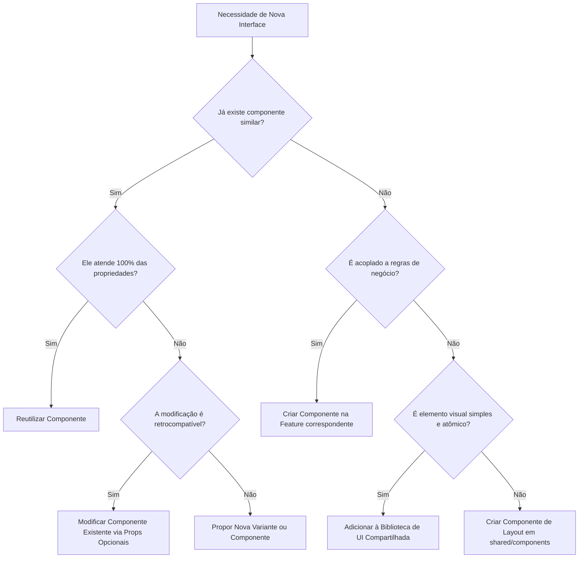

# Governança de UI - Regras de Evolução de Componentes

Este documento estabelece as diretrizes normativas para a criação, reutilização, modificação e depreciação de componentes no frontend do LexTrack, com o objetivo de conter o débito técnico e manter a consistência do design system.

---

## 1. Processo de Tomada de Decisão (Reuso > Modificação > Criação)
Antes de escrever um novo arquivo de componente no repositório, o desenvolvedor deve obrigatoriamente seguir a seguinte esteira de decisão:

---

## 2. Regras de Posicionamento Arquitetural

### A. Elementos Atômicos (`src/shared/ui/index.tsx`)
* **O que entra:** Inputs, Buttons, Selects, Badges, Spinners, Skeletons básicos e wrappers genéricos de layout (Cards).
* **Restrição:** Proibido importar qualquer hook de negócio, API helper ou constante que não seja de estilização visual pura.

### B. Componentes Semânticos de Layout (`src/shared/components/`)
* **O que entra:** Componentes estruturais reutilizáveis que possuem semântica de exibição clara, mas não se ligam a domínios específicos (ex: `KPICard`, `InfoTooltip`, `MetricCard`).
* **Restrição:** Podem utilizar dependências de design complexas (como Recharts ou Lucide Icons), mas não devem iniciar requisições HTTP internas.

### C. Componentes de Feature (`src/features/[feature_name]/components/`)
* **O que entra:** Componentes altamente acoplados a regras de negócio, tabelas específicas de dados legislativos, timelines com mappers complexos (ex: `EventTimeline`, `AIInsightsCard`).
* **Restrição:** Podem consumir hooks customizados de consulta a APIs, mas devem expor propriedades de callback para manter as visualizações testáveis sob mocking.

---

## 3. Diretrizes de Modificação e Estilo
* **Preservação do Design System:** É terminantemente proibido utilizar cores arbitrárias em hexadecimal (ex: `text-[#3f51b5]`) diretamente nas classes do Tailwind. Use sempre as cores semânticas mapeadas no design system (paletas `ink`, `volt`, ou cores neutras do tema).
* **Modificações Incrementais e Seguras:** Sempre que adicionar propriedades a componentes compartilhados, declare-as como opcionais (`props?: type`) para evitar quebras em outros locais que já consomem o componente.

---

## 4. Política de Depreciação de Código Legado
Para evitar que componentes obsoletos poluam a base de código (como ocorreu com o `KpiCard` duplicado e `TimelineTramitacao`):
1. **Identificação:** Se um componente foi substituído por uma versão melhorada, o componente antigo deve ser marcado com um comentário JSDoc `@deprecated`.
2. **Substituição Completa:** O Pull Request que introduz o novo componente deve realizar a migração e teste de todos os pontos de importação ativos.
3. **Exclusão Rápida:** O arquivo obsoleto deve ser deletado na mesma branch do PR de atualização. Não é permitida a permanência de arquivos órfãos sem rota ou consumo no projeto.
