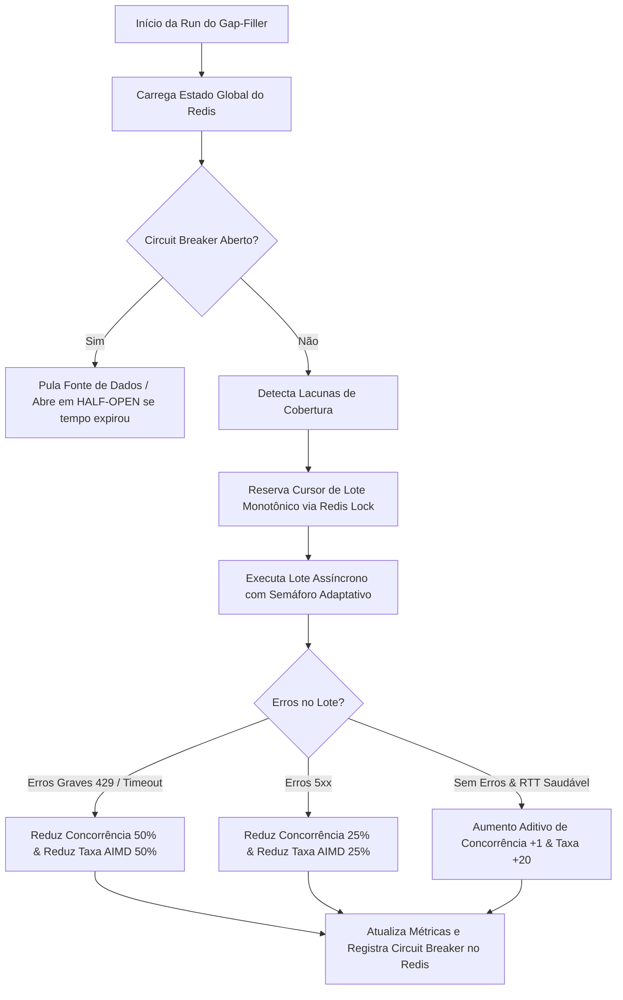

# Arquitetura de Ingestão Adaptativa, Resiliência e Políticas de Coleta (Seeding)

Este documento descreve detalhadamente o desenho arquitetural, fluxo de execução, políticas de resiliência e o guia operacional do motor de preenchimento de lacunas (seeds históricos) e coleta periódica de proposições legislativas no LexTrack.

---

## 1. Contexto e Objetivos

O LexTrack monitora o tempo de tramitação de proposições (PL e PEC) no Congresso Nacional. Para realizar análises históricas robustas e calcular baselines de confiabilidade, o banco de dados local precisa manter uma cobertura de dados idêntica à das fontes oficiais (Câmara dos Deputados e Senado Federal).

### O Desafio
*   **APIs Instáveis e Limitadas**: As APIs governamentais sofrem com indisponibilidades frequentes, picos de latência (Cold Starts) e políticas agressivas de rate limiting (`HTTP 429 Too Many Requests`).
*   **Incerteza de Cobertura**: Cargas estáticas de sementes (seeds) não garantem que registros alterados ou criados tardiamente sejam capturados.
*   **Execução Autônoma 24/7**: A esteira precisa rodar continuamente no Celery de forma assíncrona, adaptando-se dinamicamente à saúde das APIs externas sem causar bloqueio de IPs.

---

## 2. Desenho Arquitetural e Fluxo Adaptativo

A esteira de ingestão respeita o padrão de **Layered Architecture** e o isolamento de domínio definidos no projeto:

```
┌────────────────────────────────────────────────────────────────────────┐
│                              PRESENTATION                              │
│                      (FastAPI Endpoints / Controllers)                 │
└───────────────────────────────────┬────────────────────────────────────┘
                                    ▼
┌────────────────────────────────────────────────────────────────────────┐
│                              APPLICATION                               │
│  Ports: CacheProviderPort, CamaraAdapterPort, SenadoAdapterPort        │
│  Services: PreencherLacunasService, DetalheProposicaoService           │
│  Orchestration: Celery Workers (coleta_worker)                         │
└───────────────────────────────────┬────────────────────────────────────┘
                                    ▼
┌────────────────────────────────────────────────────────────────────────┐
│                                 DOMAIN                                 │
│  Entities: Proposicao, Evento                                          │
│  Exceptions: ApiConnectionError, ApiRateLimitError, ApiServerError...  │
│  Business Rules: Classificação Preditiva (Poder Executivo, Economia)   │
└───────────────────────────────────┬────────────────────────────────────┘
                                    ▼
┌────────────────────────────────────────────────────────────────────────┐
│                             INFRASTRUCTURE                             │
│  Adapters: CamaraAdapter, SenadoAdapter, RedisClient (CacheProvider)   │
│  Persistence: SQLProposicaoRepository (PostgreSQL via SQLModel)        │
└────────────────────────────────────────────────────────────────────────┘
```

### Fluxo de Controle Adaptativo (Gap-Filler)



---

## 3. Fluxo de Execução de Ponta a Ponta

O preenchimento de lacunas ocorre de forma cíclica e autônoma, mapeado nas seguintes etapas:

### Fase 1: Detecção de Lacunas
1.  **Iteração Histórica**: O serviço varre os anos de 1988 (ano da Constituição Federal) até o ano corrente para os tipos `PL` e `PEC`.
2.  **Verificação de Pruning**: Se o ano/tipo/fonte estiver marcado no Redis como consolidado permanentemente (TTL infinito) ou sincronizado temporariamente (TTL 12h para o ano corrente), ele é ignorado sem consultas ao banco ou à API.
3.  **Comparação Local vs Externo**:
    *   Consulta a contagem local de proposições: `SQLProposicaoRepository.contar(...)`.
    *   Consulta o totalizador da API oficial (cacheado no Redis por 24 horas): `Adapter.obter_total(...)`.
    *   Se a cobertura local for inferior a $95.0\%$, a lacuna é adicionada à fila de prioridades.
    *   Se a cobertura for $\ge 99.5\%$ em um ano histórico, o ano é marcado como consolidado permanentemente e retirado de futuras buscas.

### Fase 2: Entrada e Proteção de Overlap
1.  O Celery Beat aciona a tarefa `task_preencher_lacunas` a cada **15 minutos**.
2.  **Lock Global**: O worker tenta adquirir o lock exclusivo de execução no Redis (`seeding:lock:task_executando`). Se outra tarefa já estiver ativa, esta rodada aborta imediatamente para evitar race conditions.

### Fase 3: Processamento e Reserva de Offset
1.  O serviço extrai a lacuna pendente de maior prioridade (anos mais recentes primeiro).
2.  **Reserva de Offset**: O worker consulta o cursor de paginação atual do Redis (`seeding:cursor:{fonte}:{ano}:{tipo}`) e tenta reservar o bloco de processamento gravando uma chave de lock temporária baseada em token único (`seeding:lock:processando:...:{offset}`). Isso impede que múltiplos workers baixem a mesma página.
    *   Se a listagem retornar vazia em um ano histórico, o ano é consolidado e o cursor deletado. Se for o ano atual, o cursor é resetado para `0` e o cooldown de 12 horas é ativado.

### Fase 4: Download Concorrente Resiliente
1.  Instancia-se um semáforo assíncrono (`asyncio.Semaphore`) com o limite dinâmico lido do Redis.
2.  Disparam-se as requisições em paralelo para cada ID coletado no lote, passando pelo **Rate Limiter temporal** individual (`AsyncRateLimiter`) para evitar rajadas.
3.  Se uma requisição falhar com HTTP 429, o adaptador intercepta, lê o `Retry-After`, suspende a corrotina com `asyncio.sleep` e tenta novamente (até 3 tentativas).
4.  Se o download for bem-sucedido, as proposições são processadas por regras de domínio (ex: identificação de autoria e tema econômico) e persistidas em lote no Postgres via `upsert_em_lote_por_numero_canonico`.

### Fase 5: Ajuste Dinâmico e Telemetria
1.  No fim do lote, o serviço calcula a latência no percentil 95 ($P95$ RTT).
2.  Calibra a concorrência e o tamanho do próximo lote de acordo com o resultado.
3.  Se os erros 429 definitivos ultrapassarem 20% do lote, o Circuit Breaker abre por 30 minutos.
4.  Persiste os limites de forma atômica no Redis e emite logs estruturados de telemetria.

---

## 4. Tarefas Agendadas (Celery Beat & Worker)

O processamento assíncrono do LexTrack roda sob o worker Celery e Celery Beat (fuso horário: `America/Sao_Paulo`).

| Nome da Task | Frequência | Horário de Execução | Descrição |
| :--- | :--- | :--- | :--- |
| `coletar_proposicoes_diario` | Diária | 02h37 | Coleta em lote de proposições atualizadas recentemente na Câmara e Senado. |
| `recalcular_baselines_diario` | Diária | 03h00 | Recalcula baselines históricos de tempo de tramitação por grupo/fase. |
| `processar_metricas_todas_ativas` | Diária | 04h00 | Calcula IAR/IAF/IEI para todas as proposições ativas no banco. |
| `preencher_lacunas_cobertura` | Periódica | A cada 15 min | Execução do Gap-Filler adaptativo com controle de concorrência e resiliência. |

---

## 5. Matriz de Políticas por Fonte e Endpoint

Cada endpoint de API externa possui limites, tempos de resposta e comportamentos singulares. A matriz abaixo define as configurações aplicadas localmente:

| Fonte / Endpoint | Timeout por Chamada | Máximo de Tentativas | Tipo de Backoff | Criticidade para CB | Tratamento de 429 |
| :--- | :--- | :--- | :--- | :--- | :--- |
| **Câmara - Listagem** (`/proposicoes`) | 10s | 3 | Exponencial + Jitter | **Média** (Falha pula o bloco) | Respeita `Retry-After` ou aplica backoff. |
| **Câmara - Detalhe** (`/proposicoes/{id}`) | 8s | 3 | Exponencial + Jitter | **Alta** (Se $> 20\%$ falhar, abre CB) | Respeita `Retry-After` estritamente. |
| **Senado - Listagem** (`/processo`) | 12s | 3 | Exponencial + Jitter | **Média** (Falha barra o lote) | Respeita `Retry-After` ou aplica backoff. |
| **Senado - Matéria** (`/materia/{id}`) | 12s | 3 | Exponencial | **Alta** (Se $> 20\%$ falhar, abre CB) | Respeita `Retry-After` estritamente. |
| **Senado - Processo** (`/processo/{id}`) | 15s | 2 | Linear Simples | **Média** (Fallback se Matéria for 404) | Respeita `Retry-After`. |
| **Senado - Emendas** (`/materia/emendas/{id}`) | 6s | 2 | Sem Backoff | **Nula** (Fallback: assume 0 emendas) | Ignora ou recua 1s fixo. |

---

## 6. Mapeamento de Transações Atômicas e Segurança no Redis

Para evitar colisões e concorrência indevida quando múltiplos workers operam simultaneamente:

1.  **SET NX para Lock de Bloco**:
    *   A reserva de offset utiliza `set_nx(lock_chave, token, ttl=300)`.
    *   A liberação do lock é feita via script Lua executado atomicamente no Redis:
        ```lua
        if redis.call('get', KEYS[1]) == ARGV[1] then
            return redis.call('del', KEYS[1])
        else
            return 0
        end
        ```
    *   Isso garante que um worker lento **não** apague acidentalmente o lock de outro worker que tenha expirado e assumido o processo.
2.  **Optimistic Locking (WATCH/MULTI/EXEC)**:
    *   Implementado no método `obter_e_atualizar_multichaves_seguro`.
    *   Antes de alterar as taxas de concorrência ou cursor, o Redis observa (`WATCH`) as chaves.
    *   Se outra instância alterar as mesmas chaves concorrentemente, o bloco `EXEC` falha (retorna `None`). O cliente intercepta o `WatchError`, aguarda um tempo aleatório (**Jitter**) e faz até 3 retentativas automáticas.
    *   Isso garante a monotonicidade estrita do cursor (o cursor nunca retrocede).

---

## 7. Mapeamento de Arquivos no Projeto

Os arquivos responsáveis por essa engrenagem de ingestão estão mapeados abaixo:

*   [exceptions.py](../../backend/src/domain/exceptions.py) — Exceções ricas de rede e status da API.
*   [classificacao_preditiva.py](../../backend/src/domain/services/classificacao_preditiva.py) — Classificadores de autoria e tema econômico.
*   [ports/camara_adapter.py](../../backend/src/application/ports/camara_adapter.py) — Interface de acesso para a API da Câmara.
*   [ports/senado_adapter.py](../../backend/src/application/ports/senado_adapter.py) — Interface de acesso para a API do Senado.
*   [preencher_lacunas_service.py](../../backend/src/application/services/preencher_lacunas_service.py) — Motor adaptativo de seeds históricos e detecção de lacunas.
*   [adapters/camara_adapter.py](../../backend/src/infrastructure/adapters/camara_adapter.py) — Conectividade HTTP com a Câmara, parser de Retry-After e lógica de retries locais.
*   [adapters/senado_adapter.py](../../backend/src/infrastructure/adapters/senado_adapter.py) — Conectividade HTTP com o Senado, parse de emendas e retries locais.
*   [redis_client.py](../../backend/src/infrastructure/cache/redis_client.py) — Operações Lua, Optimistic Locking e chaves no Redis.
*   [celery_app.py](../../backend/src/infrastructure/workers/celery_app.py) — Configurações de schedule Celery Beat e logs estruturados.
*   [coleta_worker.py](../../backend/src/infrastructure/workers/coleta_worker.py) — Worker Celery e lock global de overlap.

---

## 8. Mapeamento das 4 Táticas de Controle Adaptativo

| Tática | Função | Chaves Redis Utilizadas | Impacto e Mitigação |
| :--- | :--- | :--- | :--- |
| **Tática 1: Pruning (Poda)** | Evita overhead de COUNTs e consultas externas em anos já preenchidos. | `seeding:consolidado:{fonte}:{ano}:{tipo}` (Históricos)<br>`seeding:sincronizado:ano_atual:{fonte}:{tipo}` (Ano Corrente, TTL 12h) | Reduz o consumo de CPU do banco local e poupa requisições de totalização às APIs em até 90%. |
| **Tática 2: Concorrência** | Controla as requisições simultâneas via semáforo baseado em latência. | `seeding:concorrencia:{fonte}` (Câmara: 2 a 20; Senado: 1 a 10) | Evita thundering herd e reduz paralelismo quando a API apresenta lentidão (RTT P95 > 1.2 segundos). |
| **Tática 3: Resiliência 429 & CB** | Trata limites de requisição e desliga o worker em caso de falha persistente. | `seeding:circuit_breaker:{fonte}:estado`<br>`seeding:circuit_breaker:{fonte}:bloqueado_ate` | Garante que o LexTrack respeite limites oficiais de rate limit (`Retry-After`). O CB abre apenas sob $>20\%$ de erros de 429 no lote, evitando reações a falsos positivos. |
| **Tática 4: AIMD & Rate Limiting** | Regula o tamanho máximo de lotes e o tempo mínimo de espaçamento de requests. | `seeding:taxa:{fonte}` (Câmara: 50 a 300; Senado: 20 a 150) | O algoritmo AIMD aumenta a velocidade de ingestão aditivamente na ausência de erros e corta pela metade de forma agressiva sob falhas de rede ou 429. |

---

## 9. Políticas de Calibração do Agendamento Dinâmico

O Celery Beat aciona a esteira a cada 15 minutos. A aplicação ajusta dinamicamente a carga de trabalho de acordo com o tamanho do backlog (número total de lacunas ativas pendentes):

1.  **Backlog Zerado (`backlog = 0`)**:
    *   **Ação**: Encerra em milissegundos (`early exit`).
    *   **Impacto**: Consumo nulo de CPU e banda.
2.  **Backlog Baixo (`1 a 100` lacunas pendentes)**:
    *   **Ação**: Limita o lote máximo de download a **20 proposições**.
    *   **Impacto**: Mantém sincronização rápida de rotina com baixíssimo impacto nas APIs.
3.  **Backlog Médio (`101 a 1000` lacunas pendentes)**:
    *   **Ação**: Limita o lote máximo de download a **150 proposições**.
    *   **Impacto**: Velocidade moderada para recuperar lacunas pontuais de anos recentes.
4.  **Backlog Alto (`> 1000` lacunas pendentes)**:
    *   **Ação**: Permite a taxa máxima definida pelo AIMD (até **300 proposições**).
    *   **Impacto**: Alto throughput de ingestão para recuperar o histórico acumulado desde 1988.

---

## 10. Estratégias de Degradação Seletiva

Sob condições extremas de lentidão ou indisponibilidade, o motor desliga recursos secundários para manter o sistema operacional:

1.  **Isolamento de Fonte**: Se a API da Câmara estiver instável (CB aberto), o Senado continua processando seu backlog de forma independente (e vice-versa).
2.  **Degradação de Endpoint (Graceful Fallback)**: Se as requisições de emendas do Senado (`/materia/emendas`) apresentarem taxa de timeout alta ou RTT lento, o adaptador suspende a busca de emendas por 15 minutos, definindo `numero_emendas = 0` na entidade criada. O preenchimento das matérias principais prossegue normalmente.
3.  **Calibração por Latência**: Caso a latência média (RTT P95) ultrapasse **1.5 segundos**, o tamanho do lote de download é reduzido automaticamente pela metade e o semáforo de concorrência é cortado ao mínimo, preservando a estabilidade da esteira.

---

## 11. Guia Operacional: Logs, Telemetria e Diagnóstico

### A. Telemetria de Lote (`[TELEMETRIA BATCH]`)
Emitida sempre que um lote individual de proposições de uma fonte é concluído (seja com sucesso total ou parcial).

*   **Exemplo de Log**:
    ```text
    INFO: [TELEMETRIA BATCH] Fonte: camara | Lacuna: 2026:PL | Processados: 18/20 | RTT P95: 380ms | Frequência Real: 5.26 req/s | Limite Semáforo: 11 | Throughput Atual: 20 itens/lote | Erros: [429_count: 0] [5xx_count: 0] [timeout_count: 0] | Max Retry-After: 0s | Cursor: 240 -> 260
    ```

### B. Telemetria de Resumo (`[TELEMETRIA RESUMO]`)
Emitida ao final de cada execução global do Celery Worker, sintetizando o estado de todas as fontes no Redis.

*   **Exemplo de Log**:
    ```text
    INFO: [TELEMETRIA RESUMO] Status da Run: catch_up
     - Câmara: [Estado CB: CLOSED] [Throughput Alvo: 80 itens/lote] [Concorrência: 10] [Falhas Run: 429=0, 5xx=0, timeouts=0] [RTT P95: 350ms]
     - Senado: [Estado CB: OPEN] [Throughput Alvo: 20 itens/lote] [Concorrência: 2] [Falhas Run: 429=3, 5xx=0, timeouts=1] [RTT P95: 1850ms]
    ```

### C. Comandos Úteis para Visualização de Logs (CLI)

As telemetrias de batches e resumo são persistidas de forma cumulativa no arquivo local `backend/logs/telemetria.log` mapeado via volume Docker, mantendo o histórico de execução mesmo que os containers sejam reiniciados.

```bash
# Visualizar o arquivo de telemetria persistido localmente (com tail em tempo real)
tail -f backend/logs/telemetria.log

# Filtrar apenas a Telemetria na saída padrão do container (efêmero)
docker compose logs -f celery_worker | grep "\[TELEMETRIA"

# Monitorar o Circuit Breaker
docker compose logs -f celery_worker | grep -E "\[BREAKER|disjuntor"

# Acompanhar o Movimento dos Cursores
docker compose logs -f celery_worker | grep -E "\[CURSOR|Resetando cursor"

# Identificar Sinais de Saturação (HTTP 429 / Timeouts)
docker compose logs -f celery_worker | grep -iE "429|too many|timeout|backoff"
```

### D. Validação do Estado no Redis (`redis-cli`)

Acesse o terminal do container do Redis:
```bash
docker compose exec redis redis-cli
```

*   **Verificar se a tarefa está rodando no momento (Lock de Overlap)**:
    ```bash
    GET seeding:lock:task_executando
    ```
*   **Checar Estado do Circuit Breaker por Fonte**:
    ```bash
    GET seeding:circuit_breaker:camara:estado
    GET seeding:circuit_breaker:camara:bloqueado_ate
    ```
*   **Verificar Throughput (AIMD) e Concorrência atuais**:
    ```bash
    GET seeding:taxa:camara
    GET seeding:concorrencia:camara
    ```
*   **Consultar Cursor de um Ano/Tipo específico**:
    ```bash
    GET seeding:cursor:camara:2026:PL
    ```
*   **Listar todos os Anos Consolidados (Pruning)**:
    ```bash
    KEYS seeding:consolidado:*
    ```

### E. Diagnóstico de Gargalos e Resolução de Problemas

| Sintoma nos Logs | Causa Provável | Diagnóstico e Ação Corretiva |
| :--- | :--- | :--- |
| **Throughput travado no mínimo** (`taxa:camara` = 50, `taxa:senado` = 20) | Resposta de erro 429 ou timeouts sucessivos. | 1. Verifique se a API externa está fora do ar ou se houve alteração na chave de API.<br>2. Verifique se o log exibe `⏳ API retornou 429. Aguardando Retry-After...`<br>3. Se a lentidão for geral na rede/infra, a latência RTT alta limitará a concorrência legitimamente. |
| **Circuit Breaker entra em `OPEN` constantemente** | Falhas de rede massivas ou rate-limit severo que excede 20% do lote. | 1. Verifique conectividade geral do container. Sem rede externa, o CB abrirá por 15m após 5 falhas consecutivas.<br>2. Se o CB abrir com tag `[BREAKER_OPENED_429]`, o limite de requisições excedeu a tolerância do Retry-After. Reduza o throughput máximo temporariamente se necessário. |
| **Cursor não avança entre runs** | Falha de listagem de IDs ou colisão concorrente de cursor. | 1. Verifique se há erros na listagem inicial. Se falhar, o cursor não é incrementado.<br>2. Verifique se o log exibe `⏭️ Offset ... já reservado`. Isso indica que outro worker está processando o mesmo lote e a execução pulou o offset com segurança. |
| **Tarefa de Ingestão passa a retornar `Status da Run: manutencao`** | O backlog de lacunas foi completamente preenchido. | **Sucesso operacional**. O banco local possui mais de 95% de cobertura histórica. O sistema monitorará em modo de baixo consumo apenas o ano corrente. |
